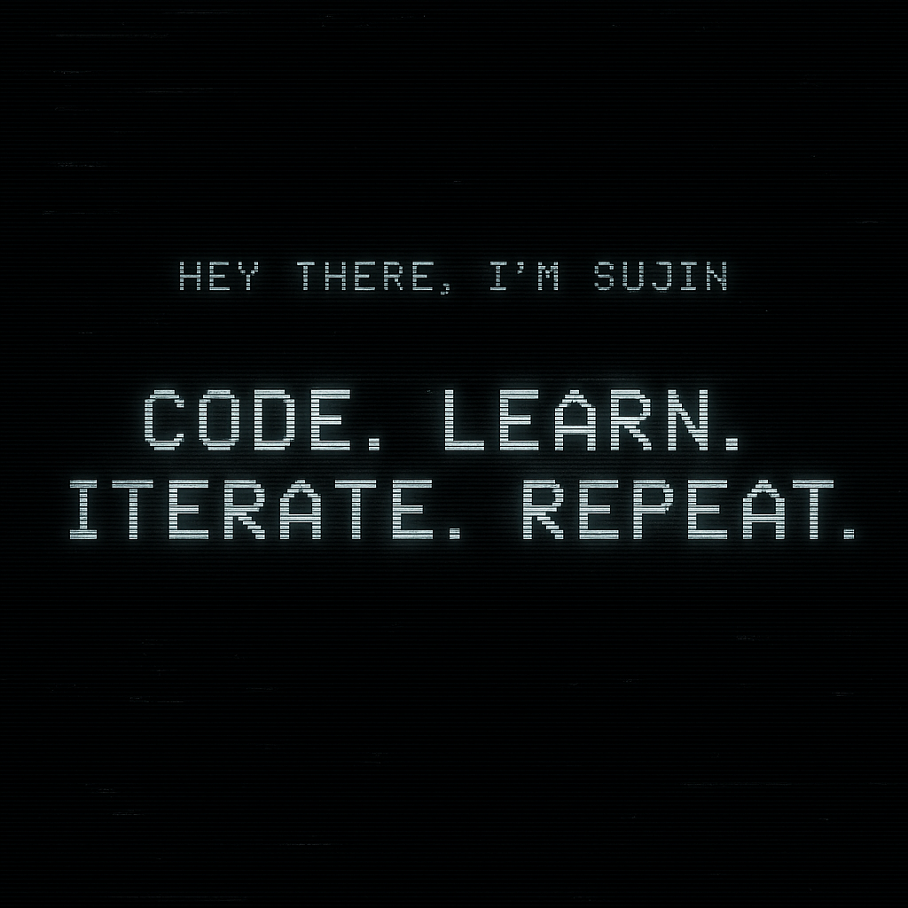

# 👋 &nbsp;Hey, I'm **Sujin K Suresh**

I'm a **Flutter Developer** from **Kerala, India** — passionate about building modern, fast, and meaningful mobile experiences.  
I’ve been coding for over **3 years**, and for the past year I’ve been deep in the **Flutter ecosystem**, shaping ideas into products that people actually use.

> “Code. Learn. Iterate. Repeat.”  
> ⚡ *Build, break, learn — until it feels like magic.*

---

## 🚀 &nbsp;What I’m working on

- 🧠 **[YeetFit](https://github.com/Sujin14/yeetfit)** — A personal fitness tracker built with Flutter + Firebase  
  🔗 [Live App](https://apkpure.net/yeetfit/com.sujin.yeetfit)
- ⚙️ **[YeetFit Admin](https://github.com/Sujin14/yeetfit_admin)** — Admin control panel for managing YeetFit users and data  
  🔗 [Live App](https://apkpure.net/yeetfit-admin/com.example.yeetfit_admin)
- 🎧 **[Z Play](https://github.com/Sujin14/Z-Play)** — A clean music player app built on modern Flutter architecture  
  🔗 [Live App](https://apkpure.net/z-play/com.sujin.musicplayer)

> 💡 Each of these is a playground for pushing architecture, design, and performance — not just another CRUD app.

---

## 🧠 &nbsp;My Skillset Matrix

| Domain | Skills | Rating |
|--------|---------|--------|
| 🎨 **Frontend & UI** | Flutter, Dart, ScreenUtil, Animations | ⭐⭐⭐⭐☆ |
| ⚙️ **State Management** | Riverpod, Provider, GetX | ⭐⭐⭐⭐⭐ |
| 🔥 **Backend & Cloud** | Firebase Auth, Firestore, Node.js | ⭐⭐⭐⭐☆ |
| 🧩 **Architecture & Navigation** | MVVM, Clean Arch, GoRouter | ⭐⭐⭐⭐☆ |
| 🧠 **Problem Solving** | LeetCode, Logic Building | ⭐⭐⭐⭐☆ |
| 🧰 **Tools** | VSCode, Android Studio, Git, GitHub | ⭐⭐⭐⭐⭐ |

> 🧡 Constantly levelling up in **app performance**, **clean code**, and **scalable architectures**.

---

## 🧰 &nbsp;My Toolbox

  
  
  
  
  
  

🧩 **Frameworks & Packages I Use Often:**  
`Riverpod`, `Provider`, `GetX`, `GoRouter`, `ScreenUtil`

---

## 💡 &nbsp;What Drives Me

I love solving logical problems, designing scalable app architecture, and mentoring others to build a stronger **developer culture**.  
Outside of Flutter, you’ll find me reading, tackling **LeetCode** challenges, and experimenting with automation and system design.

---

## 📊 &nbsp;GitHub Stats

  
  

---

## 🎯 &nbsp;Connect With Me

  
  &nbsp;
  
  &nbsp;
  

---

  

